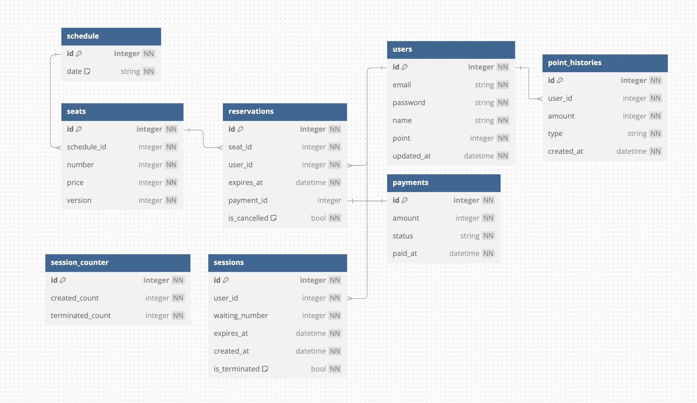

# 콘서트 티켓 예약 시스템

### Milestone

1. 분석 및 설계, 개발 환경 준비
   - 시퀀스 다이어그램 작성 (`1d`)
   - API 명세 작성 (`1d`)
   - ERD 설계 (`1d`)
2. 기능 구현, 테스트 작성
   - 기능 구현
      - 서비스 구성 설계와 도메인 객체 설계, 단위 테스트 작성 (1d)
      - 유즈케이스 구성, 인터페이스 작성 (1d)
      - 통합 테스트 작성 (1d)
3. 심화 기능 구현, 리팩토링
   - 다수의 요청 동기화
   - 토큰 리프레시 설정
   - 배치 / 스케줄러 개선
   - NestJS 테크닉을 통한 코드 개선
4. 부하 테스트, 병목 개선
   - 부하 테스트 분석 보고서 작성
   - 병목 지점 파악 및 개선
5. E2E 테스트 작성, 배포 준비
   - API 단위의 E2E 테스트 작성
   - 배포 전략 도입
   - 최종 문서화

### API 명세

[Concert Ticketing API](https://rivolt0421.github.io/HH-plus-concert/)

### Sequence Diagram

**대기열 토큰 발급 및 조회**

**토큰 만료 배치 프로세스**

**날짜 및 좌석 조회**

**좌석 예약**

**결제**

**잔액 충전 및 조회**

### ERD

**schedule**
- 콘서트 스케줄 입니다.
- 현재는 하나의 콘서트에 대한 스케줄만 존재한다고 가정했습니다.

**seats**
- 좌석 정보가 저장되는 테이블입니다.
- 하나의 스케줄에 여러 개의 좌석이 존재합니다.
- 좌석 번호와 좌석의 가격을 가지고 있습니다.

**reservations**
- 예약 정보가 저장되는 테이블입니다.
- 유저가 좌석을 예약하면 5분간 유효한 예약 정보가 생성됩니다.
- 예약에 대한 결제가 완료되면 `payment_id` 가 작성되고, 해당 예약은 결제 완료 상태로 취급됩니다.
- 예약이 취소된 경우 `is_cancelled` 가 `true` 로 변경됩니다.

**payments**
- 결제 정보가 저장되는 테이블입니다.
- 예약 정보와 1:1 관계를 가집니다.

**users**
- 유저 정보가 저장되는 테이블입니다.
- `point` 는 유저의 보유 포인트 액수를 의미합니다.

**point_histories**
- 포인트 사용 및 충전 내역이 저장되는 테이블입니다.
- `type` 은 해당 기록이 포인트 충전인지 또는 사용인지를 의미합니다.

**sessions**
- 대기열 세션의 정보가 저장되는 테이블입니다.
- `wait_number` 는 대기열에서 사용자가 부여받은 대기 번호를 의미합니다.
- 사용자가 결제를 완료하거나 세션 유효시간(10분)이 초과되면 세션은 종료됩니다.
  - 세션 만료 처리는 배치 프로세스에 의해 처리됩니다.
- 세션이 시작되거나 종료될 때 session_counter 테이블의 값이 변경됩니다.

**counter**
- 대기열에 대한 정보가 저장되는 테이블입니다.
  - `created_count`: 시작된 세션 개수의 누적 값입니다. 대기 번호 발급 시에 사용됩니다.
  - `terminated_count`: 종료된 세션 개수의 누적 값입니다. 대기 번호에 대한 입장 가능 여부를 확인할 때 사용됩니다.
- 대기번호 <= (`terminated_count` + "수용 가능 세션 개수") 이면 입장 가능합니다.